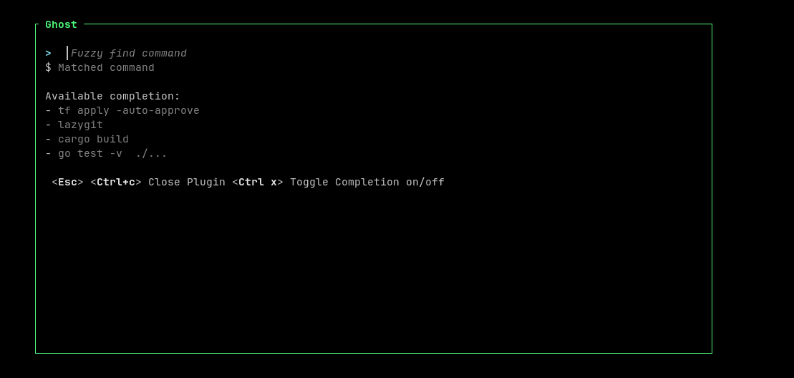

# Ghost

A [Zellij](https://zellij.dev) plugin for spawning floating command terminal pane.
Basically, it is an interactive version of `zrf` (`function zrf () { zellij run --name "$*" --floating -- zsh -ic "$*";}`).


Since `v0.3.0`, if you define a list of completions from `global_completion` plugin configuration, it will load each lines as a list of commands that you can fuzzy search (using [fuzzy-matcher](https://crates.io/crates/fuzzy-matcher)).

If the plugin finds a `.ghost` at the working dir of the plugin, it will add the working dir completions with the global_completions.




## Requirements

Zellij version `v0.40.0` or later.

| Zellij    | ghost    |
| --------- | -------- |
| `v0.40.x` | `v0.4.0` |
| `v0.41.1` | `v0.5.0` |


### Zellij Plugin Permission 

| Permission               | Why                                 |
| -------------------------|-------------------------------------|
| `ReadApplicationState`   | Subscribe to Pane and tab events    |
| `RunCommands`            | Creating Run Command floating pane  | 
| `ChangeApplicationState` | Setting plugin pane name            |

### Host Filesystem Access

> NOTE: zellij `v0.39.0` changed the `/host` path on plugin from the current zellij session working dir to the previous pane working dir (see [Release Notes](https://github.com/zellij-org/zellij/releases/tag/v0.39.0) for more info)

[Zellij maps the folder where Zellij was started](https://zellij.dev/documentation/plugin-api-file-system) to `/host` path on the plugin.

The plugin will look for a `/host/.ghost` file (i.e. the current working of the previous focussed pane) to load a list of predefined commands (like a bash_history).


Example of a `.ghost` file:
```bash
cargo build
## this is a comment starting with '#'
	# this is also a comment
terraform apply


## empty lines are also ignored
go test -v ./...

```


## Install

### Upgrade

#### Breaking Change

##### v0.4.0

* renamed config `cwd` with `exec_cwd`


### Download WASM Binary


* Download `ghost.wasm` binary from [release page](https://github.com/vdbulcke/ghost/releases).
* Verify binary signature with cosign (see instruction bellow)
* copy binary to zellij plugin dir: 
     - `mv target/wasm32-wasip1/release/ghost.wasm ~/.config/zellij/plugins/`


#### Validate Signature With Cosign

Make sure you have `cosign` installed locally (see [Cosign Install](https://docs.sigstore.dev/cosign/installation/)).

Then you can use the `./verify_signature.sh` in this repo: 

```bash
./verify_signature.sh PATH_TO_DOWNLOADED_ARCHIVE TAG_VERSION
```
for example
```bash
$ ./verify_signature.sh ~/Downloads/ghost.wasm v0.4.0

Checking Signature for version: v0.4.0
Verified OK

```


### Build from source

> WARNING: requires to have rust installed and wasm `rustup target add wasm32-wasip1`

* `git clone git@github.com:vdbulcke/ghost.git`
* `cd ghost`
* `cargo build --release`
* `mv target/wasm32-wasip1/release/ghost.wasm ~/.config/zellij/plugins/`


## Configuration

### Required Configuration

#### Zsh Shell

| Key          | value |
|--------------|------ |
| `shell`      | `zsh` |
| `shell_flag` | `-ic` |

#### fish Shell

| Key          | value  |
|--------------|--------|
| `shell`      | `fish` |
| `shell_flag` | `-c`   |


#### Bash Shell

| Key          | value  |
|--------------|--------|
| `shell`      | `bash` |
| `shell_flag` | `-ic`  |


### Optional Configuration


| Key                                                | value                      | desctiption                                                |
|----------------------------------------------------|----------------------------|------------------------------------------------------------|
| ~~`cwd` (**deprecated** use `exec_cwd` instead)~~  | directory path             | set working dir for command                                |
|  `exec_cwd` (zellij `0.40.0`)                      | directory path             | set working dir for command                                |
| `embedded`                                         | `true`                     | created command panes are embedded instead of floating     |
| `ghost_launcher`                                   | GhostLauncher pane name    | plugin will automatically close that pane                  |
| `debug`                                            | `true`                     | display debug info                                         |
| `global_completion`                                | multine list of completion | global list of completion to inlude to `/host/.ghost` file |


## Launch Plugin

```bash
zellij plugin --floating --configuration "shell=zsh,shell_flag=-ic,cwd=$(pwd)" -- "file:$HOME/.config/zellij/plugins/ghost.wasm"
```

## Config Keybindings

> NOTE: The `LaunchOrFocusPlugin` keybing action does not allow to dynamically pass the cwd to the plugin. As a workaround, you can use the `Run` keybinding action to execute the `zellij plugin` from a RunCommand pane where you can pass the plugin config `exec_cwd=$(pwd)`. The cwd should be the same as the previously focused pane.

```kdl
shared_except "locked" {

    // ghost native plugin (with default zellij cwd)
    bind "Alt (" {
        LaunchOrFocusPlugin "file:~/.config/zellij/plugins/ghost.wasm" {
            floating true

            // Ghost config 
            shell "zsh"      // required ("bash", "fish", "zsh")
            shell_flag "-ic" // required ("-ic",  "-c",    "-ic")

            // optional config
            // ghost_launcher "GhostLauncher" // name of the Ghost launcher pane (default GhostLauncher)
            // debug false                    // display debug info, config, parse command etc
            // embedded false                 // spawned command pane will be embedded instead of floating pane


            // NOTE: using 'r#"' and '"#' rust like multi string delimeter
            global_completion r#"
                tf apply -auto-approve
                cargo build
                go test -v  ./...
                
            "#
        }
    }

    // using GhostLauncher "hack" to pass the cwd=$(pwd) as runtime config 
    bind "Alt )" {
         // NOTE: you can pass the global_completion as runtim config with the '\n' delimiter between commands
         Run "bash" "-ic" "zellij  plugin --floating --configuration \"shell=zsh,shell_flag=-ic,exec_cwd=$(pwd),ghost_launcher=GhostLauncher,debug=false,global_completion=tf apply -auto-approve \ncargo build \ngo test -v  ./...\" -- \"file:$HOME/.config/zellij/plugins/ghost.wasm\"" {
            floating true
            name "GhostLauncher" // this must match ghost_launcher=GhostLauncher 
                                 // the plugin will automatically close the pane
                                 // with title "GhostLauncher"
        }
    }
}
```

## Limitations

### resizing

UI column size is not handled, so resizing to plugin window too small may crash the plugin. 
UI row size is partiallt handled, where it will minimize to a simple prompt if the plugin window becomes too small.


## Note

This my first rust project, so the code might not be the most idiomatic rust.
Inpiration was taken from other [zellij plugins](https://zellij.dev/documentation/plugin-examples).
